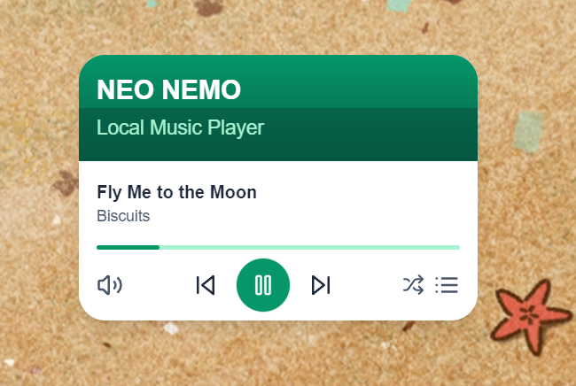
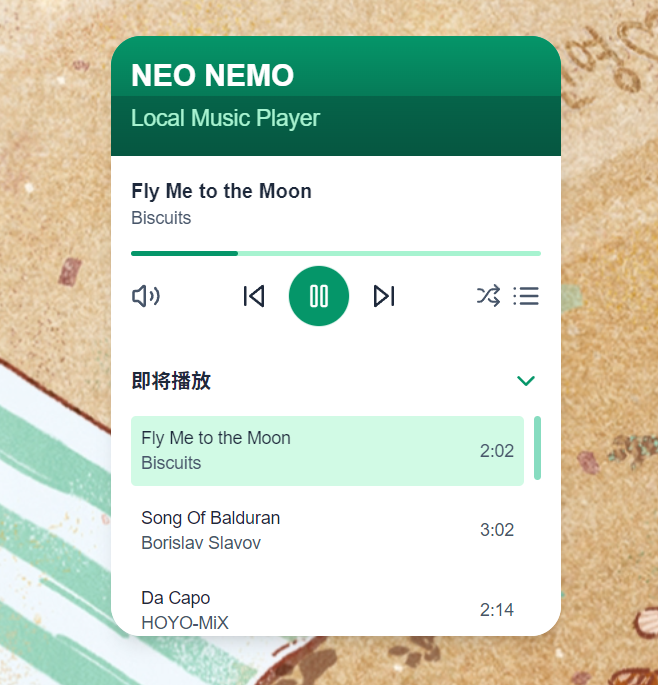

# Melody - Local Music Player

**Melody** is a minimalist local music player built using Next.js and Electron. This application is designed for users who appreciate simplicity and want an elegant, easy-to-use interface for enjoying their local music collection.

## Features
- **Play Local Music**: Browse and play music files from your local collection.
- **Minimalist Design**: A clean and intuitive interface, keeping the focus on the music.
- **Playback Controls**: Supports play, pause, skip, and shuffle.

## Screenshots
Here are some screenshots to give you an idea of what Melody looks like:

### Main Interface


### Compact View


## Installation
To get started with Melody, follow these steps:

1. **Clone the Repository**:
   ```bash
   git clone https://github.com/yourusername/melody.git
   ```

2. **Install Dependencies**:
   Navigate to the project directory and install the necessary dependencies:
   ```bash
   cd melody
   npm install
   ```

3. **Run the Application**:
   Launch the application using the following command:
   ```bash
   npm run electron:dev
   ```

## Build
To create a production build of the application:
```bash
npm run build
```

## Technologies Used
- **Next.js**: For building the user interface.
- **Electron**: To wrap the Next.js app as a desktop application.
- **TypeScript**: Ensuring type safety and better development experience.

## Contributing
If you would like to contribute to Melody, feel free to submit a pull request or open an issue. Contributions are always welcome!

## License
This project is licensed under the MIT License.

## Contact
For any questions or suggestions, please contact [your email address].

